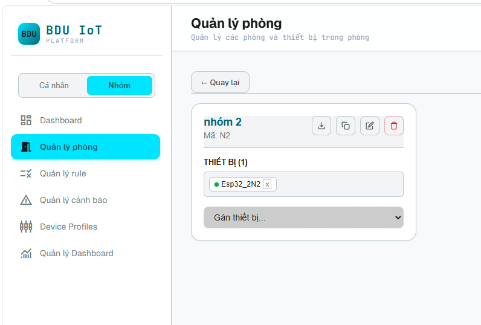
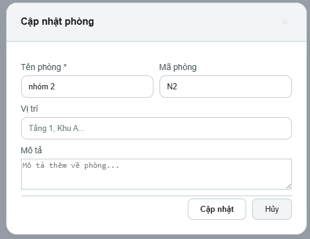

# 01. Workspace và Tạo phòng

Phần này hướng dẫn chọn đúng workspace và tạo phòng trên IoT Platform BDU.

---

## 3.1. Chọn đúng workspace trước khi thao tác

Ở thanh điều hướng bên trái, chọn tab **Cá nhân** hoặc **Nhóm** tùy theo mục đích sử dụng. Nếu thiết bị cần dùng chung cho các thành viên trong nhóm, hãy thao tác trong tab **Nhóm** ngay từ đầu để tránh nhầm quyền quản lý thiết bị.

*Hình 1. Giao diện quản lý phòng trong workspace Nhóm.*

---

## 3.2. Tạo phòng

1. Vào menu **Quản lý phòng**.
2. Chọn chức năng tạo mới hoặc cập nhật phòng.
3. Nhập **Tên phòng**, **Mã phòng**, **Vị trí** và **Mô tả** nếu cần.
4. Lưu lại thông tin phòng để sử dụng khi tạo thiết bị.

*Hình 2. Biểu mẫu tạo/cập nhật phòng.*

> **Khuyến nghị đặt tên**: Tên phòng nên ngắn gọn, dễ nhận biết, ví dụ: `Nhóm 2`, `Phòng A101`, `Lab IoT`. Mã phòng nên thống nhất theo quy ước nội bộ, ví dụ: `N2`, `A101`, `LAB-IOT`.

Tiếp theo: [02. Tạo thiết bị](./02-create-device.md)