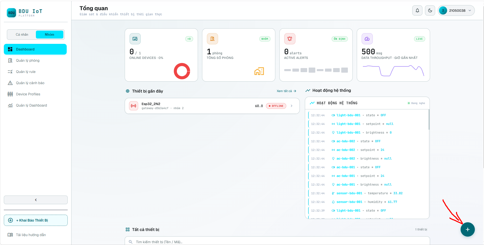
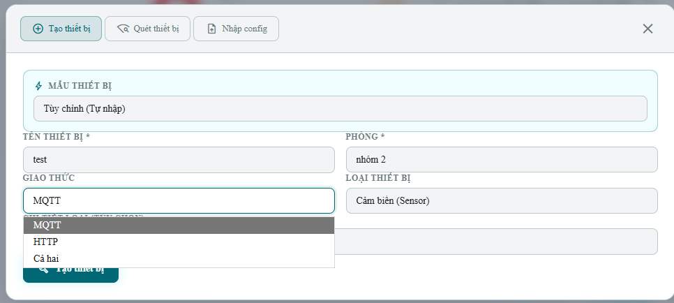
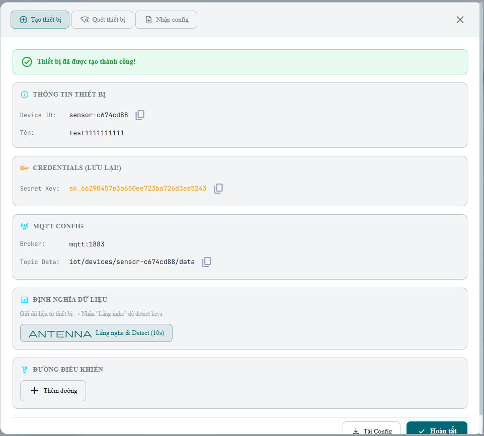

# 02. Tạo thiết bị và Lưu thông tin kết nối

Phần này hướng dẫn tạo thiết bị mới trên Platform và lưu các thông tin kết nối quan trọng.

---

## 3.3. Tạo thiết bị mới

1. Quay lại **Dashboard** hoặc giao diện trang chủ.
2. Bấm nút **dấu cộng (+)** ở góc dưới bên phải để mở màn hình tạo thiết bị.

*Hình 3. Nút dấu cộng (+) dùng để tạo thiết bị mới trên Dashboard.*

3. Nhập **tên thiết bị** theo chức năng hoặc vị trí lắp đặt.
4. Chọn **giao thức** giao tiếp: **MQTT** hoặc **HTTP**.
5. Chọn **phòng** vừa tạo ở bước trước.
6. Chọn **loại thiết bị** phù hợp, ví dụ `Gateway`, `Sensor` hoặc loại thiết bị khác theo nhu cầu.
7. Bấm **Tạo thiết bị** để hoàn tất.

*Hình 4. Biểu mẫu tạo thiết bị và lựa chọn giao thức MQTT/HTTP.*

> **Chọn giao thức như thế nào?**
> - **MQTT** phù hợp khi thiết bị cần gửi dữ liệu cảm biến định kỳ hoặc liên tục.
> - **HTTP** phù hợp khi thiết bị có endpoint nội bộ và Platform cần gửi lệnh điều khiển trực tiếp qua LAN.

---

## 3.4. Lưu thông tin kết nối của thiết bị

Sau khi tạo thiết bị thành công, Platform hiển thị các thông tin quan trọng để cấu hình firmware. Cần lưu lại tối thiểu **Device ID**, **Secret Key** và **Topic Data**. Đây là các thông tin dùng để thiết bị xác thực và gửi dữ liệu lên hệ thống.

*Hình 5. Màn hình tạo thiết bị thành công và thông tin kết nối cần lưu lại.*

> **Bảo mật Secret Key**: Secret Key đóng vai trò như mật khẩu của thiết bị. Không đưa Secret Key lên mã nguồn công khai, ảnh chụp màn hình công khai hoặc kho GitHub dùng chung.

Tiếp theo: [03. Điều khiển & Chi tiết](./03-control-and-detail.md)