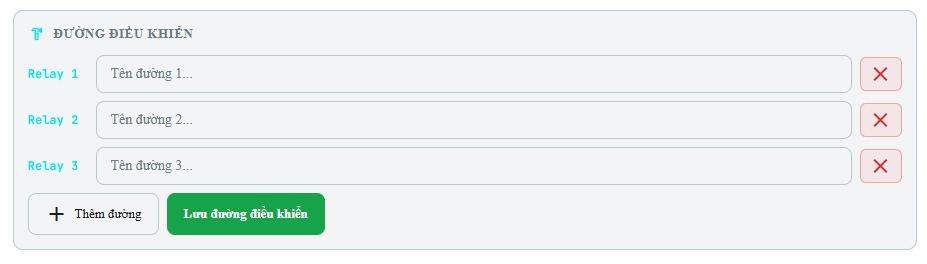
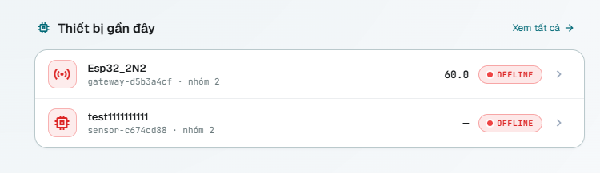
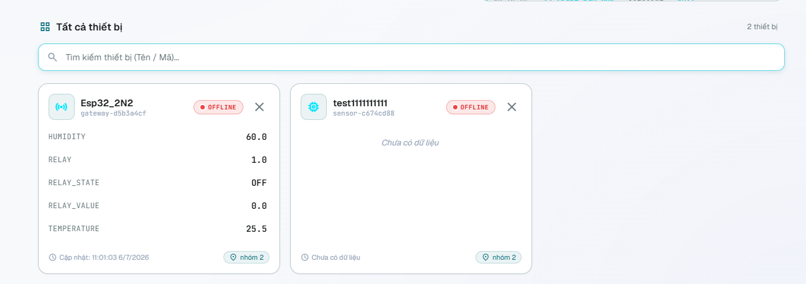
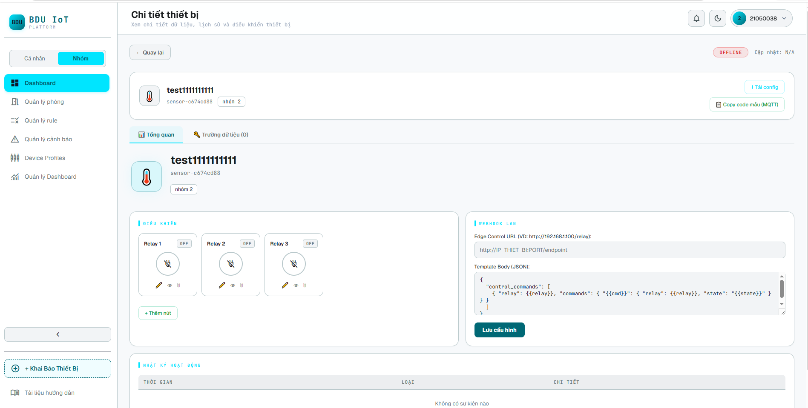

# 03. Cấu hình điều khiển, Chi tiết và Tải config

Phần này hướng dẫn cấu hình đường điều khiển, kiểm tra chi tiết thiết bị và tải file cấu hình mẫu.

---

## 3.5. Cấu hình đường điều khiển

Nếu board mạch có **relay**, **công tắc** hoặc kênh điều khiển, cần tạo số lượng đường điều khiển tương ứng trên Platform. Mỗi đường điều khiển nên được đặt tên rõ chức năng, ví dụ `Relay đèn`, `Relay quạt` hoặc `Relay khóa cửa`.

1. Trong khu vực **Đường điều khiển**, bấm **Thêm đường**.
2. Nhập tên cho từng đường điều khiển.
3. Số đường điều khiển nên tương ứng với số relay/công tắc thực tế trên board.
4. Bấm **Lưu đường điều khiển**.
5. Bấm **Hoàn tất** để kết thúc quá trình tạo thiết bị.

*Hình 6. Cấu hình các đường điều khiển tương ứng với relay/công tắc.*

*Hình 7. Thiết bị vừa tạo xuất hiện trong danh sách trên Dashboard.*

---

## 3.6. Kiểm tra chi tiết thiết bị

Trên Dashboard, bấm vào card thiết bị để mở trang chi tiết. Tại đây có thể xem dữ liệu tổng quan, trạng thái thiết bị, cấu hình điều khiển, **Webhook LAN** và các tiện ích như tải config hoặc sao chép code mẫu MQTT.

*Hình 8. Trang chi tiết thiết bị, khu vực điều khiển và Webhook LAN.*

> **Lưu ý về Webhook LAN**: Webhook LAN chỉ cần cấu hình khi thiết bị chạy HTTP và Platform cần gọi lệnh điều khiển đến thiết bị qua mạng LAN. Nếu thiết bị sử dụng MQTT thuần để gửi dữ liệu, có thể bỏ qua phần Webhook LAN.

---

## 3.7. Tải config hoặc sao chép code mẫu

1. Bấm **Tải config** để xem toàn bộ cấu hình thiết bị ở dạng file, bao gồm **Device ID**, **Secret Key**, **Broker/Host**, **Port**, **Topic Data** và cấu hình điều khiển.
2. Hoặc bấm **Copy code mẫu (MQTT)** để lấy code mẫu và dán vào Arduino IDE.
3. Chỉ thay đổi các phần liên quan đến Wi-Fi, chân kết nối phần cứng và logic xử lý cảm biến/relay. **Không xóa** các biến cấu hình kết nối Platform nếu chưa hiểu rõ.

*Hình 9. File cấu hình chi tiết của thiết bị sau khi tải về.*

Tiếp theo: [04. Cấu hình ESP32](./04-esp32-setup.md)