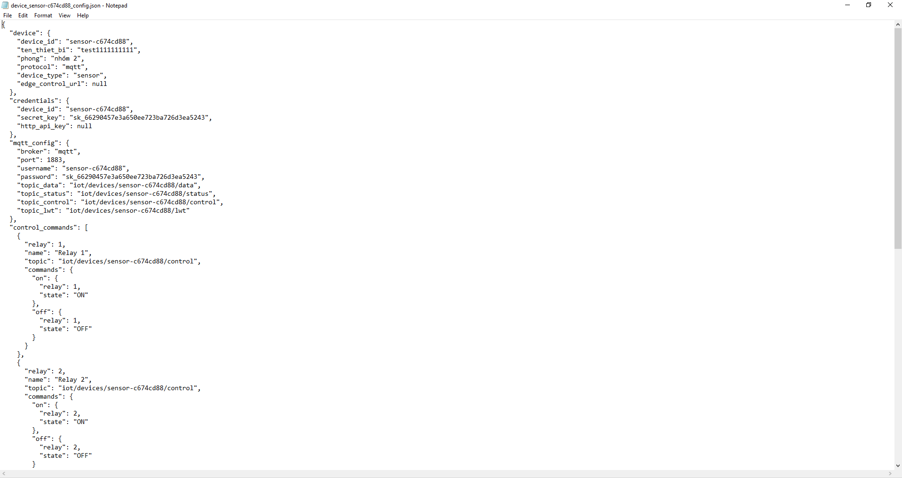

# 04. Thiết lập và cấu hình ESP32

Phần này hướng dẫn thiết lập firmware cho ESP32 dựa trên code mẫu từ Platform.

---

## 4.1. Nguyên tắc giữ lại cấu hình Platform

Khi sao chép code mẫu MQTT từ Platform sang Arduino IDE, cần **giữ lại** các biến cấu hình kết nối Platform. Các phần có thể thay đổi gồm:

- Tên Wi-Fi, mật khẩu Wi-Fi.
- Chân GPIO.
- Thư viện cảm biến.
- Logic đọc/ghi dữ liệu.



*Hình 10. Code mẫu MQTT được sao chép sang Arduino IDE.*

```cpp
// Ví dụ nhóm cấu hình cần giữ lại hoặc cập nhật đúng theo Platform
const char* WIFI_SSID     = "TEN_WIFI_2_4GHZ";
const char* WIFI_PASSWORD = "MAT_KHAU_WIFI";
const char* MQTT_HOST = "<broker-hoac-dia-chi-server>";
const int   MQTT_PORT = 1883;
const char* MQTT_USER = "<ma_thiet_bi>";
const char* MQTT_PASS = "<secret_key>";
const char* TOPIC_DATA = "iot/devices/<ma_thiet_bi>/data";
```

> **Wi-Fi 2.4 GHz**: ESP32 phổ biến chỉ hỗ trợ Wi-Fi 2.4 GHz. Nếu sử dụng mạng 5 GHz hoặc mạng có portal đăng nhập, thiết bị có thể không kết nối được.

---

## 4.2. Cấu hình IP cho thiết bị HTTP hoặc gateway LAN

Nếu thiết bị dùng HTTP để nhận lệnh điều khiển từ Platform, nên cấu hình **IP tĩnh** cho ESP32 hoặc đặt **DHCP reservation** trên router. Việc này giúp Platform luôn gọi đúng địa chỉ thiết bị, tránh lỗi điều khiển sau khi router cấp lại IP.

```cpp
// Ví dụ cấu hình IP tĩnh cho ESP32 khi dùng HTTP/Webhook LAN
IPAddress espStaticIP(192, 168, 1, 241);
IPAddress espGateway (192, 168, 1, 1);
IPAddress espSubnet  (255, 255, 255, 0);
IPAddress espDNS1    (192, 168, 1, 1);
WiFi.config(espStaticIP, espGateway, espSubnet, espDNS1, espDNS1);
```

Tiếp theo: [05. Nạp chương trình](./05-esp32-upload.md)