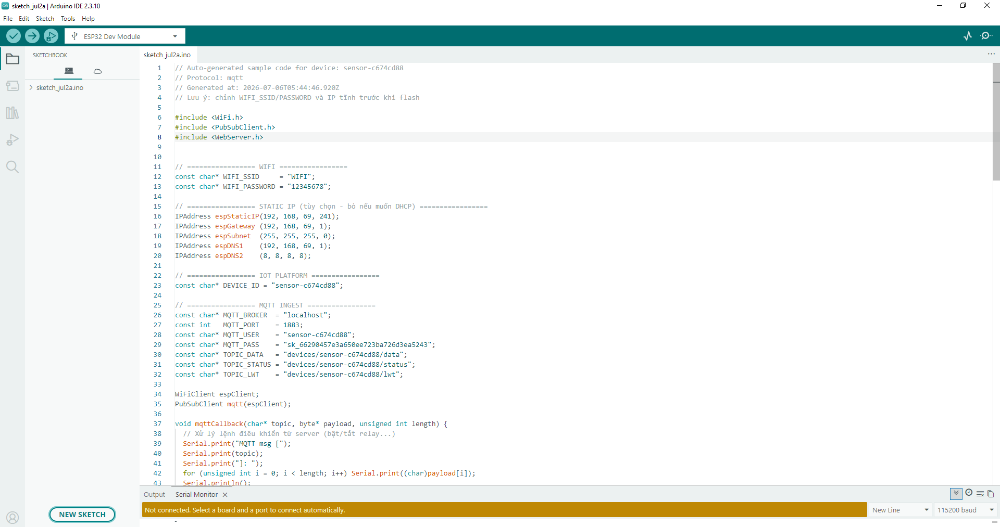

# 05. Nạp chương trình cho ESP32

Phần này hướng dẫn chuẩn bị thư viện và nạp chương trình cho ESP32 trong Arduino IDE.

---

## 4.3. Chuẩn bị thư viện và nạp chương trình

- Mở **Arduino IDE** và chọn đúng board ESP32.
- Cài đầy đủ thư viện cần dùng cho cảm biến, màn hình, servo, MQTT hoặc HTTP client.
- Dán **code mẫu** từ Platform vào file chương trình.
- Cập nhật Wi-Fi, thông tin Platform và chân GPIO theo mạch thực tế.
- Bấm **Verify/Compile** để kiểm tra lỗi biên dịch.
- Cắm ESP32 bằng cáp USB dữ liệu, chọn đúng cổng **COM** và bấm **Upload**.
- Mở **Serial Monitor** để kiểm tra trạng thái Wi-Fi, kết nối Platform và dữ liệu gửi lên.

*Hình 11. Kiểm tra và nạp chương trình cho ESP32 trong Arduino IDE.*

Tiếp theo: [06. Kiểm thử vận hành](./06-testing.md)